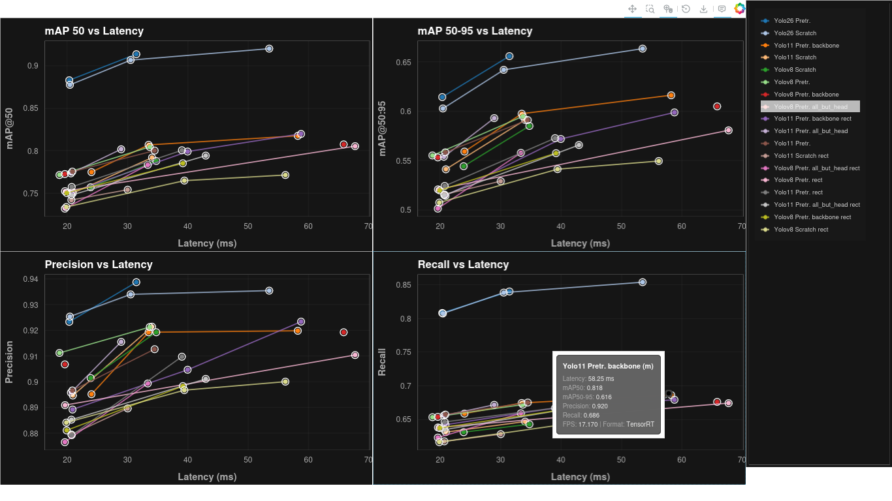
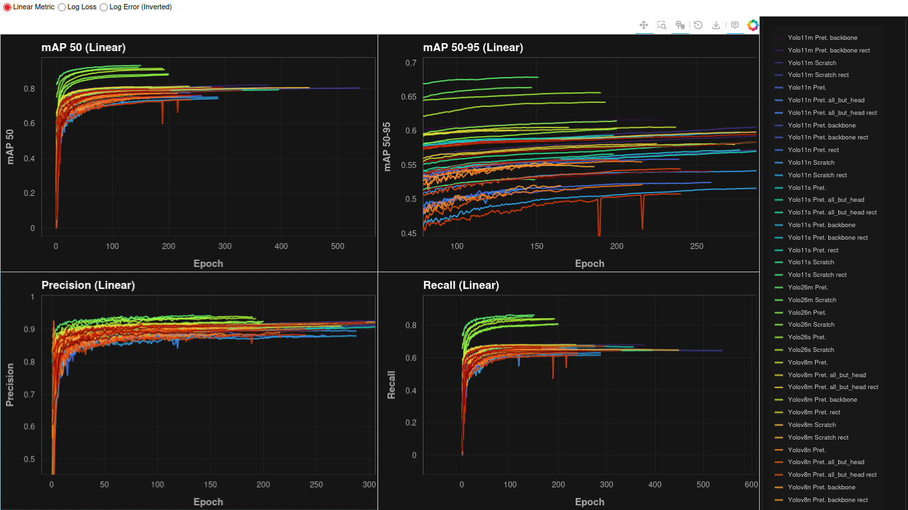
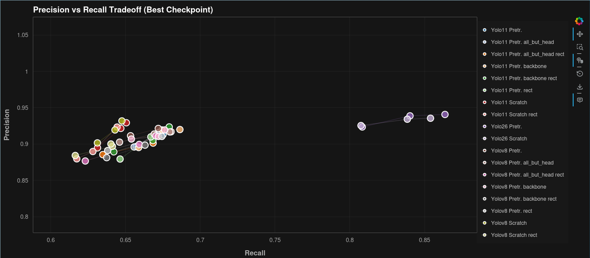
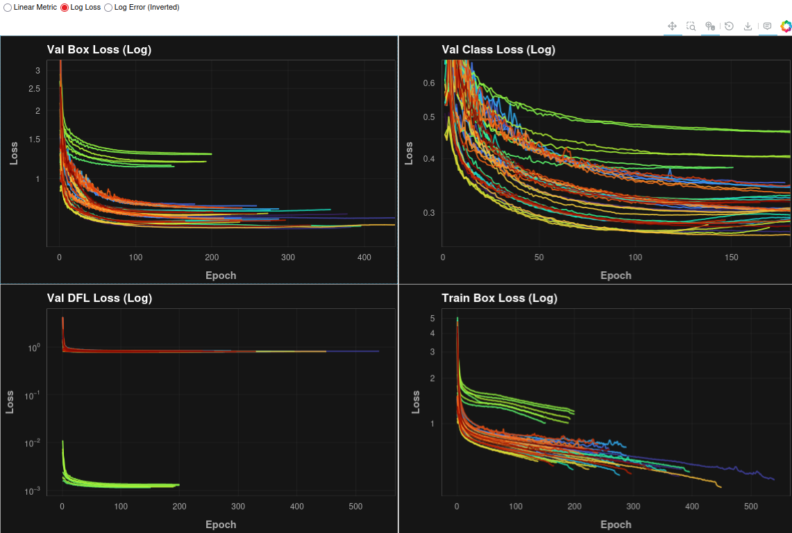

# Ultralytics Experiments Visualization
Visualize the results of experiments run with the [ultralytics](https://github.com/ultralytics/ultralytics) library using `bokeh` and serving them via a local HTTP server.
This package is a quick way of comparing metrics and training results of ultralytics models. It supports:
- Training curves (mAP, precision, recall, loss) in several scales (linear, log, error rate (1 - <metric>))
- Metrics vs latency (pareto frontier similar to the one in the ultralytics benchmarks)
- Precision-Recall tradeoff, in order to tune the models for a specific use case.
- View details of the training or metric curves by zooming / hovering to see the detail tooltips.

> [!IMPORTANT]: This repo assumes that the directory structure, file names for experiments and CSV files, and the content of the CSV file containing the inference latency results are in a specific format. this format will be specified below. 

# What you'll see

The following images show the different visualizations that are generated by this package:

| Metrics vs Latency | Training Curves (linear) |
|:---:|:---:|
|  |  |

| Precision-Recall Tradeoff | Training Curves (log loss) |
|:---:|:---:|
|  |  |

## Directory Structure and File Names

The directory structure is expected to be as follows:
```bash
experiments/
    ├── combined_results.csv # results of benchmark / inference stats
    └── experiments*/
        ├── list
        │   ├── experiment_1_yolo26.yaml # metadata of experiment
        │   ├── experiment_2_yolo26.yaml
        │   └─ ...
        └── train
            ├── experiment_1_yolo26
            │   ├── ...
            │   └─ results.csv # training results, ultralytics baked in
            ├── experiment_2_yolo26
            │   ├── ...
            │   └─ results.csv
            └── ...
```

The `combined_results.csv` file is expected to have that name (change it if you will) and the following columns:
```csv
model,Format,Size_MB,mAP50,Inference_ms_im,FPS
yolov8n_pretrained_full_rectFalse,TensorRT,13.2,0.77133,18.72,53.41
yolov8n_pretrained_backbone_rectFalse,TensorRT,13.0,0.77048,19.6,51.02
yolov8n_pretrained_head_rectTrue,TensorRT,13.1,0.73223,19.61,50.99
...
```

The experiment metadata in the `list/*.yaml` files is expected to have the following format:
```yaml
batch_size: 0.9
early_stop_epochs: 16
epochs: 346
experiment_name: yolo11m_pretrained_backbone_rectFalse
freeze_layers: backbone
model_size: m
model_version: yolo11
pretrained: true
rect_mode: false
... # more over here
yolo_args_yaml:
  data: train.yaml
  device: cuda
  exist_ok: true
  project: experiments/train
  save_period: 20
  workers: 8
  ... # more over here
``` 

As you see, the names are made by composing the model version, the variant (pretrained or scratch), the size, and the freezing strategy (if any). The rect mode is also added to the name.

> [!NOTE] **Vibe coding alert!**: Part of this code was vibe coded, mainly the parts using `bokeh`, and so it might not be the most performant or the most pythonic way to do it. Just be advised. The code itself is not that long / hard to read, so you are welcome to improve it. 


## TODOS
- [x] Add a new plot to represent the tradeoff between precision and recall

- [ ] CORRECT THE NAMING IN THE COMBINED RESULTS SCRIPT!!!!

- [x] Integrate with the actual inference time results:
    - [ ] See if the results already output a validation metrics
    - [x] adapt mocks for the actual data returned by `ultralytics.utils.benchmarks`
    - [ ] run with and without int8 quantization and half precision

- [x] add mb's, fps and format to the tooltip

- [x] integrate a way to just display top N models by filtering the dataframe before creating the plots

- [x] Legend can not scroll since there is not currently any scroll support for legends as they are drawn on the HTML canvas directly, which has not DOM scrolling capabilities. Figure out a way to make it so it doesn't break when too many models are displayed, regardless of top N filtering (should work without it). Maybe change the layout (2x2) of the plots if there are too many, change the location instead of add_layout


### Non-urgent TODOS

- [ ] Scale should auto-adjust dynamically depending on the minimum Y axis value from each series, and also when removing some of the plots by clicking the legend

- [ ] make tooltip textbox slightly transparent to see the background behind

- [ ] add a "hide everything" button to the legend

- [ ] add a way to display the metrics one by one instead of in a 2x2 grid (performance and usability) 

- [ ] make the page be the same color as the background of the plots

- [x] make the lines hide with the legend in the precision-recall plot